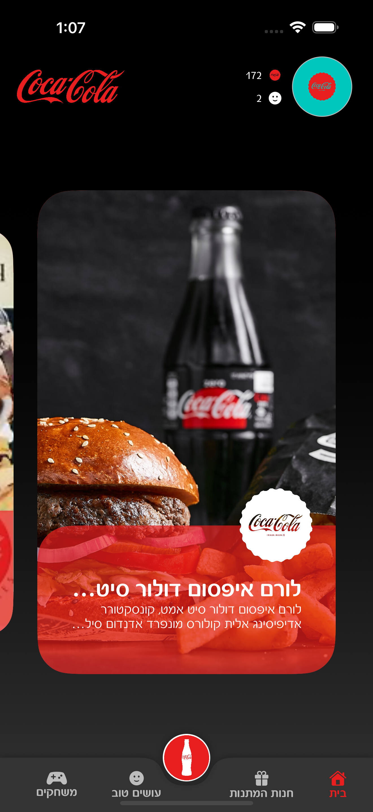

# CocaCola iOS App



## Features
- Custom curved `BottomAppBar` with centered FAB
- Infinite horizontal card paging using `CircularBuffer`
- Scale animations on cards while scrolling

## Technical Stack
- iOS 17.0+
- Swift 5.9+
- SwiftUI + UIKit integration
- MVVM Architecture

## Project Structure
```
CocaCola/
├── CocaCola/
│   └── CocaColaApp.swift
├── UI/
│   ├── Components/
│   │   ├── Bottom App Bar/
│   │   ├── Paging View/
│   │   └── Top App Bar/
│   └── Screens/
│       ├── RootView.swift
│       ├── Home/
│       │   ├── HomeView.swift
│       │   └── HomeViewModel.swift
│       ├── GiftShopView.swift
│       ├── VolunteeringView.swift
│       └── GamesView.swift
├── Core/
│   ├── Constants/
│   ├── Extenstions/
│   └── Utils/
├── Data/
│   └── Model/
└── Resources/
    └── Fonts/
```
## Key Components

### BottomAppBar
Custom implementation of Material Design's bottom navigation bar with:
- Centered FAB
- Custom shape with FAB cutout
- Tab selection animations
- Support for variable number of tabs

```swift
BottomAppBar(tabItems: [
    TabItem(label: Label("Home", systemImage: "house.fill"),
            content: AnyView(HomeView())),
    // Add more tabs as needed
])
```

### CircularScrollView
Infinite scrolling implementation featuring:
- Smooth scrolling behavior
- Card scaling animations
- Efficient content recycling
- Support for custom content

```swift
CircularScrollView(items: ["Title0", "Title1", "Title2", "Title3"])
```

### PagingView
UIKit integration providing:
- Smooth paging behavior
- Scale animations
- Snap effect
- Endless scroll (netflix like)
- Content recycling
